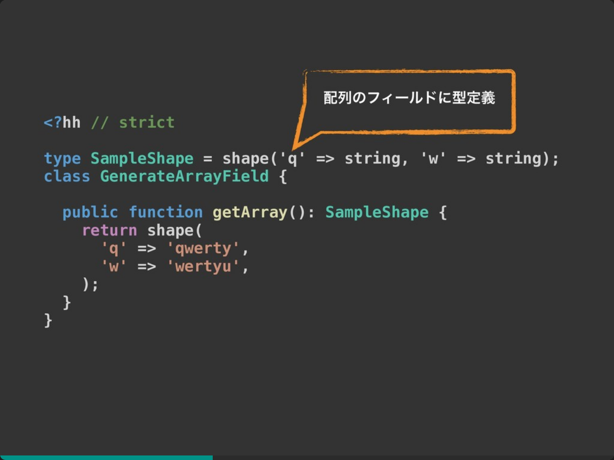
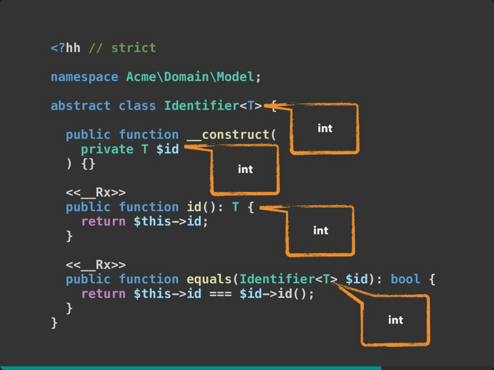

# PHPカンファレンス仙台参加レポート
## [Hackで作る堅実な アプリケーションアーキテクチャ / Hack-application-architecture](https://speakerdeck.com/ytake/hack-application-architecture)
### TL;DR
* PHPと比較して、Hackの採用メリットは、静的型付き言語としての機能がほしいかどうか
  * PHP7の登場で、速度的なメリットは減った
  * 代わりにPHPより型に厳しく出来るメリットがある
  * MapやShape、GenericといったPHPにはない機能もある
* facebookやSlack、有志の人によってライブラリも豊富になってきた
* 型に厳格なので、DDDと相性も良い
* 並列処理もできるので、PHPの苦手な部分を補えそう

### なぜこのセッションを聞いたのか
このセッションを聞いた大きな要因は、もともとHackに興味があったからです。  
`PHPのような構文でかける静的言語` というところに魅力を感じました。  
しかし、PHPも7で高速化し、Hackをどの局面で使うかというところには、「？」が出ておりました。  

そこでこのセッションで、言語的な話や使い所を知ろうと思いました。

### 内容
前半は静的言語としての強力な機能の話、後半はアプリケーション設計の話を行っていました。  

前半の話で魅力的だったのは、`Shape`という機能になります。  
`Shape`は配列のフィールドに対して、型判定ができ、PHPよりも強力になっています。  
普段PHPで配列を扱うと、配列にどんなKeyValueが入っているかはダンプをしないとわからない状態になり、コードを読む際に苦労することがあります。  
この`Shape`なら、それが解決できるので、魅力的だなと感じました。 
[https://speakerdeck.com/ytake/hack-application-architecture?slide=54](https://speakerdeck.com/ytake/hack-application-architecture?slide=54)

後半のアプリケーション設計の話は、PHPでTraitやinterface、DIを使ったことがないので、なかなかピンとこなかったです…。
理解できた範囲で面白かったのは、下記のようにT(単なる当て字)を定義することで、使う側で定義する型を決められるところでした。  
使う側によっては、IDもUUIDのようにStringにしたい時があると思いますが、そういうときにも型判定ができるのが良いです。
[https://speakerdeck.com/ytake/hack-application-architecture?slide=119](https://speakerdeck.com/ytake/hack-application-architecture?slide=119)
### まとめ
PHP7の登場により、速度的なメリットはなくなったHHVMですが、Hackという強力な言語が登場することによって、まだまだ活躍の機会はありそうだなと思いました。  

本編では触れられてませんでしたが、asyncも使えるので、並列処理する場合は、PHPよりHackを使う場合が良さそうです。