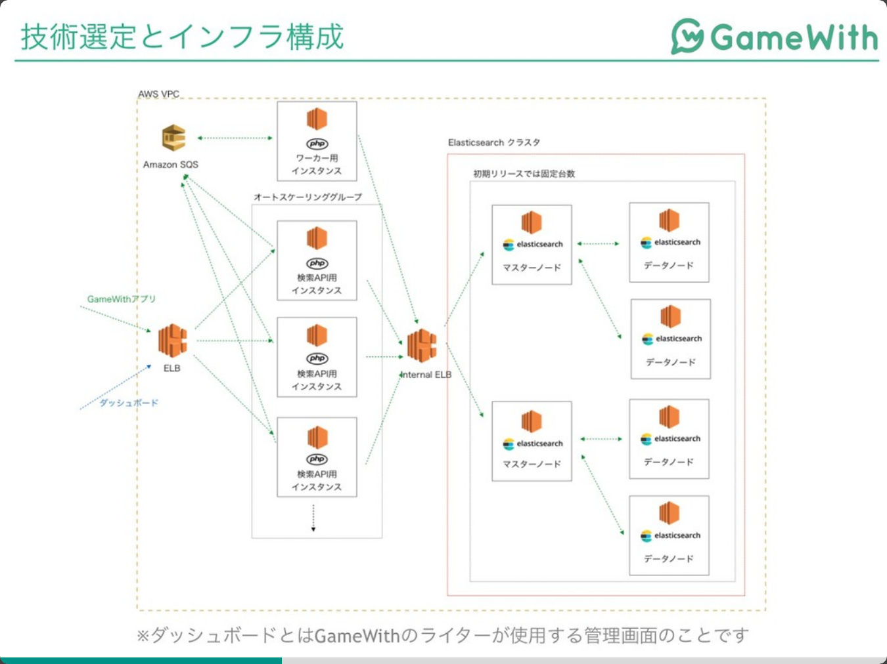

# PHPカンファレンス仙台参加レポート
## [開発期間2ヶ月でElasticsearchをプロダクトに使ってリリースした話](https://speakerdeck.com/memory1994/php-conference-sendai-2019-presentation-slides)
### TL;DR
* 技術選定を工夫した
  * Go言語にしたかったが、社内でかける人がいないのでやめた
  * GroongaとElasticsearchで迷った
    * PV数が多いのでスケールしやすElasticsearchを選んだ
* 通常の保守も並行して行っていたので、開発で思いついたことはGithubのissueに上げまくって、忘れないようにした
  * アクシデントで自分が開発できなくなることも考慮し、内容は自分以外も分かるように書いた
### なぜこのセッションを聞いたのか
自分は業務で主にPHPを使った開発を行っており、かつ近くある案件で、データの集計を行う案件があります。  
その案件で、どういった技術を使うか自分の中で考えており、その一案でElasticsearchが使えないか気になっており、情報収集を行いにいきました。
### 内容
検索APIの作成のため、ElasticsearchとPHP7.2+Laravel5.6を使った話です。  
このセッションの内容は、スライドを読んでもらえると、概ね把握できるかなと思います。  

少ないリソースでも新しい技術を導入したこと、他メンバーのスキルセットも考慮したことは、自分が技術を導入する際にも参考になります。  

スライドに書いていない内容でピックアップは、Elastic社の方から指摘された内容を口頭でお話していました。  
指摘内容は、 `Elasticsearchのマスターノードは前面に出さないほうが良い` という話でした。  
マスターノードが落ちると、データノードも落ちてしまうので、それは避けた方が良いとのことです。
Elasticsearchを運用している人の、参考になれば幸いです。
[https://speakerdeck.com/memory1994/php-conference-sendai-2019-presentation-slides?slide=21](https://speakerdeck.com/memory1994/php-conference-sendai-2019-presentation-slides?slide=21)
