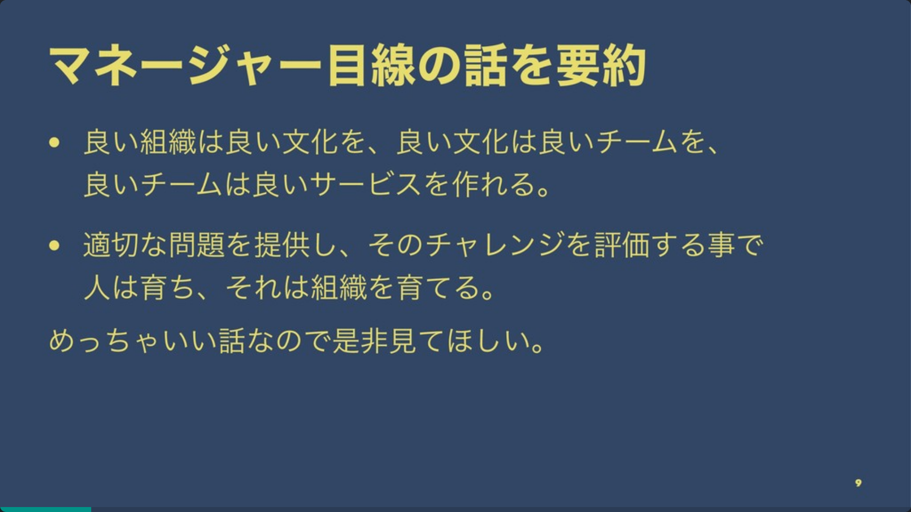

# PHPカンファレンス仙台参加レポート
## [オミカレを支えるチーム開発 \~プロダクトを支える文化\~/phpconference-sendai2019-omicale](https://speakerdeck.com/takahashiikki/phpconference-sendai2019-omicale)

### TL;DR
* 東京と岡山の2拠点に分かれているので、Slackでの情報共有を強化する
* 心理的安全性を養う活動をする
  * hubotでの遊び心
  * 絵文字のリアクションでのフィードバック
  * 分報で気軽なコミュニケーション

### 内容
株式会社オミカレさんが文化の話をするのは、PHPカンファレンス2018に続き2回目です。  
その時はCTOが、マネージャー目線でできることとして、[適切な問題と文化がサービスを育てる](https://soudai.hatenablog.com/entry/2018/12/15/141456)という話をしていました。  
今回はプレイヤー目線で何を行ったかという話になります。  

ちなみに前回の要点はこちらになります。
[https://speakerdeck.com/takahashiikki/phpconference-sendai2019-omicale?slide=9](https://speakerdeck.com/takahashiikki/phpconference-sendai2019-omicale?slide=9)

今回の話でとても参考になったのは、心理的安全性を育てるために、 `会話Botや絵文字のリアクションを行う` というところです。  
自分のこととして捉えたとき、何かの機能をリリースしたときに、営業・開発部門問わず、リアクションを貰えるのは嬉しいと思いました。 `コミュニケーション` を問題視するとき、質の問題を取り上げがちですが、チャットでのコミュニケーションの場合は、感情も重要だと思います。  
発言をした人の感情が伝わらないと、受け手が意図を汲み取り違え、コミュニケーションロスが発生すると思います。  
なので、文字ベースで感情が伝わりづらい部分は、絵文字で補うと良いのだろうなと思いました。

また小さな問題を見逃さないのも良いなと思いました。  
スライド上でレビューが溜まってしまう問題や、KPIなどの数値を準備するのが大変という問題と、それをどう解決したか記載されています。これらは日頃のちょっとした会話や、チャットから生まれたものを課題として捉えたということのようです。  
自分たちのチームでも、おそらくこういう問題は発生していて、それが拾えていないんだろうなと思いました。  
ちょっとしたことでも、チームのために活動することで、チームが良く回っていくのだと思いました。

### まとめ
オミカレはコミュニケーションを活発に行うことで、小さな課題も見つけていき、技術や仕組みでそれを解決する文化ができているようです。
自分たちも良いところは取り入れて、自分たちなりの文化を形成していきたいです。