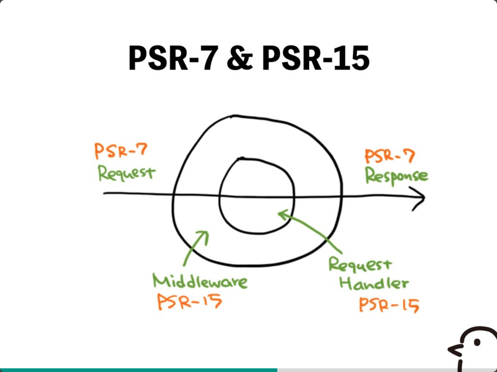

# PHPカンファレンス仙台参加レポート
## [PHPのmiddlewareを 使いこなすために](https://speakerdeck.com/hiro_y/phpfalsemiddlewarewo-shi-ikonasutameni)
### TL;DR
* Webアプリケーションで共通でやりたいことがある
  * 全てのリクエストがあったら、やりたい処理（ex.ログイン判定）
  * 全てのレスポンスを返すときにやりたい処理もある
* PSRで標準規約を作る
  * PSR-7はリクエストとレスポンス
  * PSR-15はミドルウェアとリクエストハンドラ
* PSR-7やPSR-15を駆使すれば、FWなしでサービスもできるかも

### なぜこのセッションを聞いたのか
このセッションで触れている、PSR-7とPSR-15の違いがわかっていなかったので、それについて聞いてみようと思い、参加しました。
どちらかというと、知識的なところの補充を期待していました。

### 内容
PSR-7とPSR-15の説明をするにあたって、Webアプリケーションでなぜ必要になるかという話から始まり、説明がわかりやすいと思いました。

PSR-7とPSR-15は下記の図で分かる通り、リクエストとレスポンスを担当するのがPSR-7、ミドルウェアとリクエストハンドラを担当するのがPSR-15となるようです。
[https://speakerdeck.com/hiro_y/phpfalsemiddlewarewo-shi-ikonasutameni]https://speakerdeck.com/hiro_y/phpfalsemiddlewarewo-shi-ikonasutameni?slide=30)

### 所感
最近Go言語ではFWを使わないこともあるという話を聞くことがありました。  
標準パッケージが豊富なため、FWを使わなくても良いそうです。  
今回の話を聞いて、PHPでも同様の世界観が訪れるかもなと思いました。

話の内容は面白そうだったのですが、自分の理解力不足でこれくらいの認識になってしまいました…。

### 備考
スライド中で公開されていた、ログミーのリニューアル記事は下記となります。  
面白い内容だったので、興味がある人は読んでみてください。
* [真っ当な技術を使ったふつうのWebサービス開発––Webメディアのリニューアルにおいて考えたこと - ログミーTech](https://logmi.jp/tech/articles/320556)