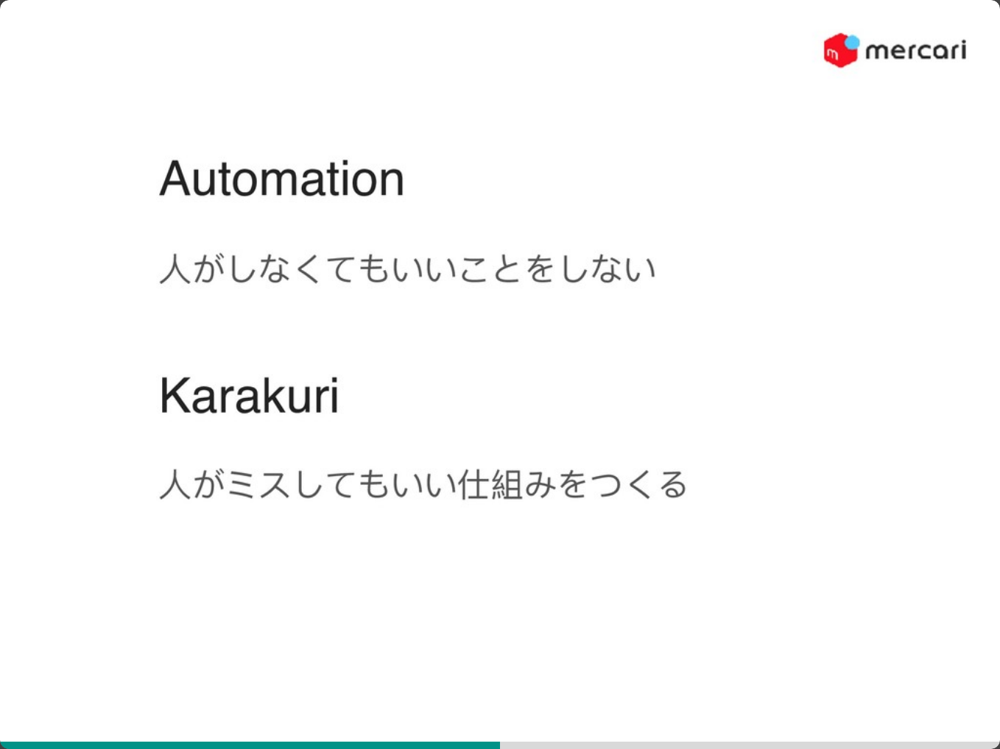

# PHPカンファレンス仙台参加レポート

## [再発防止策を考える技術 / #phpconsen](https://speakerdeck.com/sota1235/number-phpconsen)

### TL;DR
* システム障害は提供しているサービスによって変わる
  * ここでは `ユーザに影響が出る` ことをシステム障害と捉える
  * 潜在的な問題を発生させた場合も、システム障害と捉える
    * 学びのチャンスなので、スルーしない
* システムを運用する限り、障害が起きる可能性は0ではないと認識する
* どんな優秀な人間でもミスをする
  * ダブルチェックを運用しても、ミスをする可能性がある存在が2つになっただけ
* 振り返りについて
  * 責任の追求と反省文の読み合わせをしない
  * オートメーションでカバーできる方向を考える
  * チーム横断で、振り返りをする
    * 歴戦の勇からの見解を聞く
    * 別職種の見解を聞く
* 全ての問題を完璧に対応しようとしない
  * コスパが悪いものが大半なので、できる範囲でオートメーション化していく

### なぜこのセッションを聞いたのか
自分たちも24時間のサービスを運用するにあたって、大小様々な障害を経験しています。  
同じように24時間のサービスを展開しているメルカリでは、どのような振り返りを行っているか、気になったため聞いてみました。

### 内容
システム障害を、新しい学びの場と捉えて、技術で対応していく話でした。  
特にAutomationとKarakuriという発想は、素敵だなと思いました。
[https://speakerdeck.com/sota1235/number-phpconsen?slide=36](https://speakerdeck.com/sota1235/number-phpconsen?slide=36)  
自分たちのチームでは、静的解析を導入できていなかったりするので、人力のコードレビューですり抜けると、障害になってしまう状況です。  
そういった部分は、Automationで解決していきたいと思いました。  
この話を聴く前に、PHPのシンタックスチェックを自動化でチェックする環境を作っているので、引き続き対応していきたいと思います。  

またユーザのご操作で障害が発生したこともあるので、ご操作が起きても問題ない仕組みを作る必要があるなと感じました。

自分たちが取り入れないといけないと思った点に、振り返りを横断でやることも挙げられます。  
自分たちは運用チームや、インフラチームとも連携して仕事をしていますが、障害が発生して対応した際は、アプリケーションエンジニアだけで振り返りをやっていました。  
すると、運用チームやインフラチームに絡んだ話が出た際に、その場で解決するのが難しくなったり、（意図せず）視点が偏ったりすると思います。  

横断で振り返りを行い、これらの問題に対処していきたいです。

### まとめ
障害が発生してしまった過去は変えられないので、再発しないように問題の洗い出しと、技術での解決を考えていきたいです。