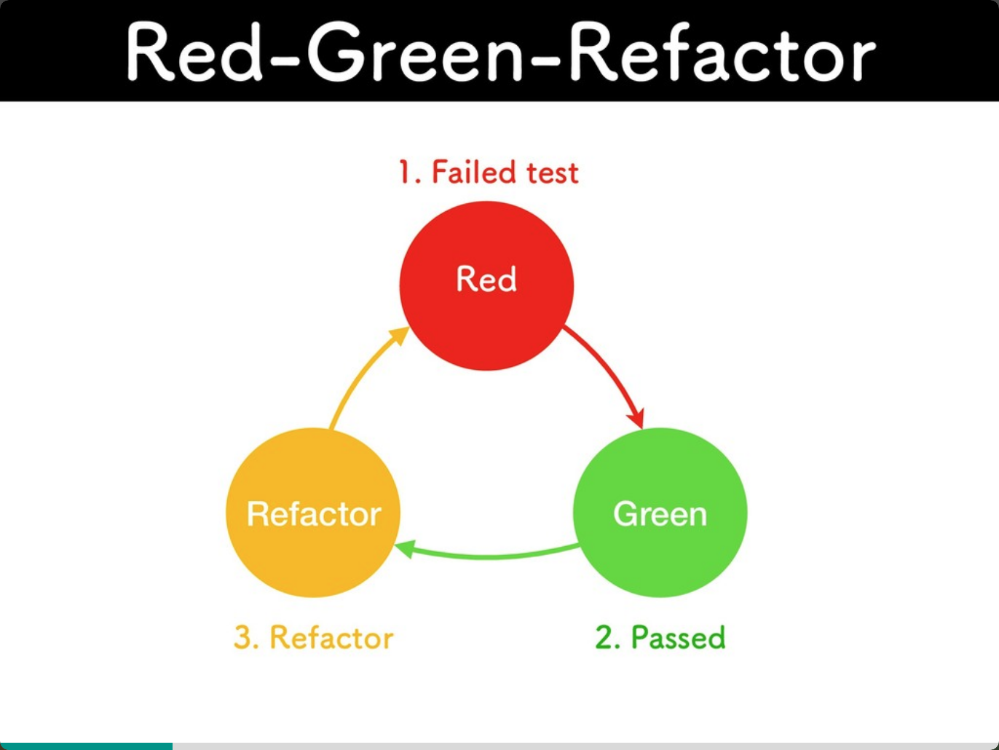
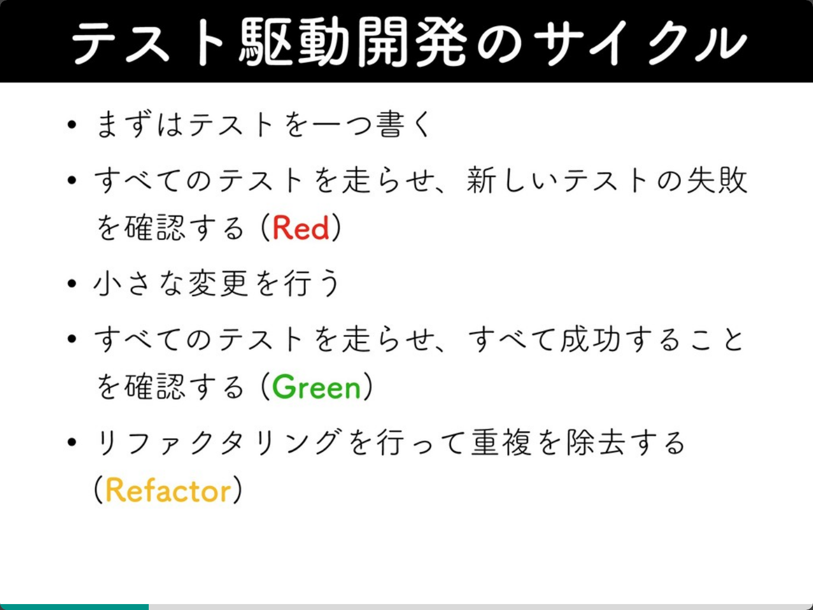

# PHPカンファレンス仙台参加レポート
## [テストが辛いを解決するテスト駆動開発のアプローチ at PHPカンファレンス仙台2019](https://speakerdeck.com/hgsgtk/tesutokaxin-iwojie-jue-surutesutoqu-dong-kai-fa-falseahuroti-at-phpkanhuarensuxian-tai-2019)
### TL;DR
* テストがない要因は色々あると思うが、今回は下記2点に絞って話す
  * テストを書くのが億劫
  * テストを書くのが難しいコードになる
* テストを書くのが億劫な理由
  * 実装後にテストを書くとこうなりがち
  * 実装のリズムの一環でテストをかけるようにする
    * TODOリストにテストを書くの内容を書く
    * テストを書いてコケる
    * 実装してテストを書く
    * ↑を繰り返して実装していく
  * テストを書くのが難しいコードになる
### なぜこのセッションを聞いたのか

### 内容
テストを書く事が辛くならないように、TDDを取り入れましょうという話でした。  
ポイントは、 *TODOリストでテストを書く内容を可視化し、コケるのが分かっていてもテストを書いて動かす* という部分なのかなと思いました。  
テストを書く一番大事なことは、コケることだと思います。  
テストがコケることで、実装に問題があることを気づく事ができます。  

実際の発表では、ライブコーディング下記の図のように、テストを書く→テストを動かす→失敗する→プログラミング→テストが成功する、のサイクルを行い、とてもわかりやすい内容でした。  
[https://speakerdeck.com/hgsgtk/tesutokaxin-iwojie-jue-surutesutoqu-dong-kai-fa-falseahuroti-at-phpkanhuarensuxian-tai-2019?slide=19](https://speakerdeck.com/hgsgtk/tesutokaxin-iwojie-jue-surutesutoqu-dong-kai-fa-falseahuroti-at-phpkanhuarensuxian-tai-2019?slide=19)[https://speakerdeck.com/hgsgtk/tesutokaxin-iwojie-jue-surutesutoqu-dong-kai-fa-falseahuroti-at-phpkanhuarensuxian-tai-2019?slide=20](https://speakerdeck.com/hgsgtk/tesutokaxin-iwojie-jue-surutesutoqu-dong-kai-fa-falseahuroti-at-phpkanhuarensuxian-tai-2019?slide=20)

後半はテストを書くことで、プログラムのイケてない部分も直す話でした。  
自分たちのプロダクトで、テストコードがないものがありますが、そういうコードはテストが書きづらいほど密結合になっています。  
テストを書いてから、実装することでそういうケースも回避できるし、後々引っかかりそうなイケてない部分も修正できるのかなと思いました。

またスライドであるように、テストが書きづらい部分の匂いを感じ取るには、経験や学習が必要なので、そこは自分たちも取り組んでいく必要があるなと思いました。
### まとめ
テストを先に書くことで、心理的な安心を手に入れよう。  
またテストを書く際に、書きづらいと感じた部分は、設計を見直すことも考えてみよう。